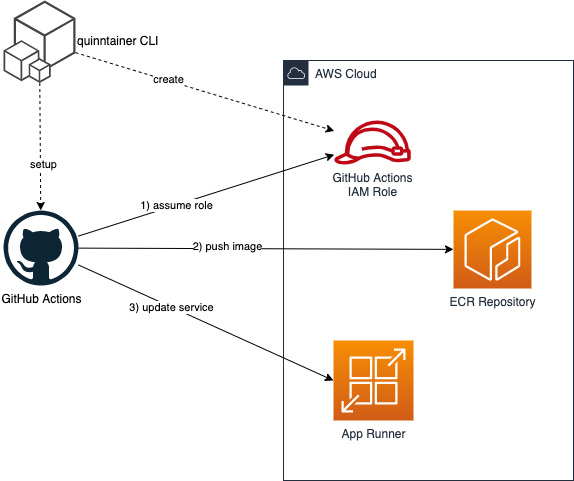
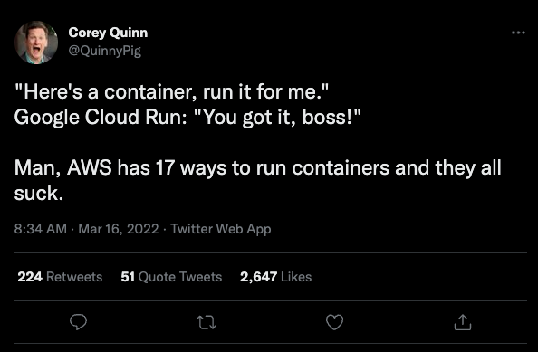

# Overview

[](https://github.com/nektos/quinntainer/releases/latest) [](https://www.npmjs.com/package/quinntainer)

This repo contains an action for deploying containers to AWS. It will build a docker image from a `Dockerfile` in the repo, push the image to [Amazon ECR](https://aws.amazon.com/ecr/) and the run the container via [AWS AppRunner](https://aws.amazon.com/apprunner/).

The repo also contains a CLI tool to setup the GitHub workflow in your repo and also setup the AWS IAM role necessary for GitHub Actions to assume via [OpenID Connect](https://docs.github.com/en/actions/deployment/security-hardening-your-deployments/configuring-openid-connect-in-amazon-web-services).



# Quickstart

To setup your application for _quinntainers_, run the following from within your application directory.

```
npx quinntainer init
```

# Why?

This tool was inspired by a tweet from [Corey Quinn](https://twitter.com/QuinnyPig) following his experiences with Google Cloud Run. He's right - for his use case, Google Cloud Run is much easier. Therefore, the only appropriate solution is to create the `18th` way to run containers on AWS 🚀



# Example Workflow

```
name: Deploy
on:
  push:
    branches: 
    - main

permissions:
  id-token: write
  contents: read

jobs:
  deploy:
    concurrency: deploy
    runs-on: ubuntu-latest
    steps:
    - uses: nektos/quinntainer@v1
      with: 
        aws-region: us-west-2
        role-to-assume: arn:aws:iam::0123456789:role/quinntainer-gha-myorg-myrepo
        port: 80
```

# Action Inputs

The actions supports the following inputs:

| Input | Description |
| ----- | ----------- | 
| `aws-region` | AWS Region, e.g. us-east-2 |
| `role-to-assume` | ARN of IAM Role to assume via GHA OIDC |
| `port` | Port listening in container |
| `cpu` | CPU to allocate to container (Default: `1024`) |
| `memory` | Memory to allocate to container (Default: `2048`) |
| `docker-build-context` | Path to docker build context (Default: `.`) |
| `dockerfile` | Path to Dockerfile (Default: `Dockerfile`) |
